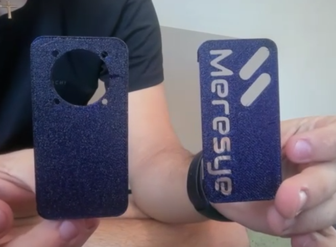
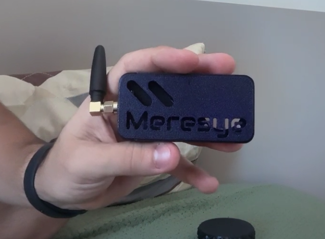

# 🛰️ 5G Wardriving & Deauther DIY Project


Este é um projeto **DIY (Do It Yourself)** focado em segurança cibernética e análise de redes sem fio. O dispositivo combina capacidades de **Wardriving** (mapeamento de redes Wi-Fi e geolocalização) com a funcionalidade de **Deauther** (testes de desautenticação), agora atualizado para lidar com frequências e redes modernas, incluindo suporte a bandas mais altas (5G/Dual‑Band).

O grande diferencial deste projeto é o design compacto e portátil da **case impressa em 3D**, projetada sob medida para acomodar os componentes de forma segura e eficiente.

---

## 📸 Demonstração do Projeto (Case 3D)

Abaixo você pode conferir o design e a montagem final do dispositivo na case personalizada:


<br>



<br>



---

## 🛠️ Funcionalidades

* **Wardriving Avançado:** Varredura e mapeamento de redes Wi-Fi (2.4GHz e 5GHz) com registro de coordenadas geográficas.
* **Ataques de Desautenticação (Deauther):** Ferramenta integrada para testes de estresse e auditoria de desconexão de clientes na rede.
* **Interface Portátil:** Display integrado para monitoramento em tempo real sem a necessidade de um computador externo.
* **Case Customizada:** Arquivos STL inclusos para impressão 3D, garantindo portabilidade e proteção aos componentes.

---

## 📂 Estrutura do Repositório

```
├── xq4vrkt.png       # Imagem da case 3D - Vista 1
├── 9f0k8k0.png       # Imagem da case 3D - Vista 2
├── kmnvhk7.png       # Imagem da case 3D - Vista 3
├── firmware/         # Código-fonte do dispositivo (.ino, .py, etc.)
├── hardware/         # Arquivos STL para impressão 3D e esquemas de circuito
├── docs/             # Manuais, esquemas de pinagem e documentação extra
└── README.md         # Instruções gerais do projeto
```

🚀 Como Começar
1. Hardware e Impressão 3D
Vá até a pasta /hardware e baixe os arquivos .STL.

Imprima as peças utilizando o material de sua preferência (recomendado: PLA ou PETG para maior resistência).

Monte o circuito seguindo o diagrama de pinagem disponível na pasta de documentação.

2. Firmware (Software)
Abra o código da pasta /firmware na sua IDE de preferência (Arduino IDE, VS Code + PlatformIO, etc.).

Instale as bibliotecas necessárias listadas no cabeçalho do código.

Faça o upload para o seu microcontrolador.

⚠️ Isenção de Responsabilidade (Disclaimer)
[!WARNING]
Este projeto foi desenvolvido estritamente para fins educacionais e de pesquisa em segurança cibernética (White Hat). O uso desta ferramenta para atacar redes de terceiros sem autorização prévia é ilegal. O desenvolvedor não se responsabiliza pelo uso indevido ou danos causados por este dispositivo.

📝 Licença
Este projeto está sob a licença MIT. Sinta-se livre para clonar, modificar e distribuir, desde que mantenha os créditos originais.

Desenvolvido com ☕ e paixão por segurança cibernética.
